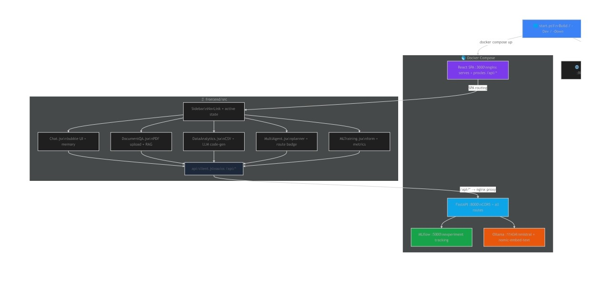

# DataForge AI

> **Multi-Agent Intelligence Platform** — Fully local, production-ready AI system for data analysis, document Q&A, ML training, and more.


---

## ✨ Features

| Feature | Details |
|---|---|
| 💬 **Contextual Chat** | Per-session memory, rolling 20-message window, `tinyllama` LLM via Ollama |
| 📄 **Document Q&A (RAG)** | Upload any PDF → chunk → `nomic-embed-text` embeddings → FAISS top-k=3 retrieval → grounded answer |
| 📊 **Data Analytics** | Upload CSV → auto summary → ask in plain English → LLM generates & safely executes pandas code → plain-English answer |
| 🧠 **Multi-Agent (LangGraph)** | Planner classifies query → routes to RAG / Data / Calculator / Direct LLM → Response synthesiser polishes the answer |
| 🔬 **ML Training + MLflow** | Train 4 scikit-learn models, auto label-encode, track params/metrics/artifacts in MLflow |
| 🔌 **MCP Server** | Model Context Protocol endpoints expose every tool as a callable HTTP API at `/mcp/tools/*` |
| ⚛️ **React Frontend** | Dark-theme SPA (Vite + Tailwind) with 5 dedicated pages, real-time chat bubbles, collapsible code panels |
| 🐳 **Docker Compose** | One-command full-stack deployment — Frontend + API + MLflow + Ollama |
| 🟦 **PowerShell Launcher** | `start.ps1` starts containers, polls health endpoints, opens 3 browser tabs automatically |

---

## 🏗️ Architecture



## 🧩 Component Deep-Dive

### ⚛️ 1. React Frontend (`frontend/`)

Built with **Vite + React 18 + Tailwind CSS**. Served by nginx in Docker; proxied through Vite's dev server locally.

| Page | Route | Description |
|---|---|---|
| **Chat** | `/` | Bubble-style conversation with auto-scroll, session memory, and a clear-history button |
| **Document Q&A** | `/documents` | Drag-click PDF upload → index → freeform question → grounded RAG answer |
| **Data Analytics** | `/analytics` | CSV upload → shape/column overview → NL question → answer + collapsible generated code + raw output |
| **Multi-Agent** | `/agents` | Free-text query, colour-coded route badge (RAG / DATA / CALC / DIRECT), collapsible tool output |
| **ML Training** | `/training` | Model selector, test-split slider, MLflow experiment name, live metrics grid, MLflow link |

**Key files:**

```
frontend/
├── Dockerfile            # Multi-stage: Node 20 build → nginx 1.27 serve
├── nginx.conf            # SPA fallback + /api/ proxy (300s timeout, 100MB upload)
├── vite.config.js        # Dev proxy  /api/* → localhost:8000
├── tailwind.config.js    # Custom brand colour (sky-blue)
└── src/
    ├── api/client.js     # Axios wrappers for every backend endpoint (base: /api)
    ├── components/
    │   └── Sidebar.jsx   # Brand logo, NavLink active state, external links
    └── pages/
        ├── Chat.jsx
        ├── DocumentQA.jsx
        ├── DataAnalytics.jsx
        ├── MultiAgent.jsx
        └── MLTraining.jsx
```

> In Docker the browser always calls `localhost:3000/api/*`, which nginx proxies to `api:8000/*` inside the Docker network — no CORS or hard-coded API URLs in the bundle.

---

### ⚡ 2. FastAPI Backend (`main.py` + `app/api/routes.py`)

- **CORS** middleware allows `localhost:3000` (Docker) and `localhost:5173` (Vite dev)
- **MCP sub-app** mounted at `/mcp` via `app.mount()`
- `/health` endpoint used by Docker healthcheck and `start.ps1`

---

### 📄 3. RAG Pipeline (`app/rag/rag_pipeline.py`)

```
PDF upload → PyPDFLoader → RecursiveCharacterTextSplitter (500 tokens / 50 overlap)
          → OllamaEmbeddings("nomic-embed-text")
          → FAISS.from_documents()   ← stored in module-level _vectorstore
Query     → FAISS.similarity_search(k=3)
          → context string → tinyllama prompt → grounded answer
```

| Setting | Value |
|---|---|
| Embeddings model | `nomic-embed-text` (Ollama) |
| Vector store | FAISS (in-memory, per upload) |
| Chunk size | 500 characters |
| Chunk overlap | 50 characters |
| Retrieval k | 3 documents |
| LLM | `tinyllama` (Ollama) |

---

### 📊 4. Data Analytics Engine (`app/utils/data_analyzer.py`)

```
CSV upload → pd.read_csv() → stored in module-level _dataframe
NL query  → LLM generates pandas code → _safe_exec() (restricted namespace)
          → raw output → LLM interprets in plain English
          → returns {answer, code, output}
```

`_safe_exec` runs generated code with only `{"df": df, "pd": pd}` in scope — no builtins exposed — to prevent arbitrary code execution.

---

### 🧠 5. Multi-Agent System (`app/agents/multi_agent.py`)

Built with **LangGraph `StateGraph`**. State is a `TypedDict` with four fields: `query`, `route`, `tool_output`, `response`.

```
                ┌──────────────┐
    query ────► │   Planner    │ ── classify ──► route ∈ {rag, data, calculator, direct}
                └──────────────┘
                       │
          ┌────────────┼────────────────┐
          ▼            ▼                ▼                 ▼
     RAG Agent    Data Agent    Calculator Agent    Direct Agent
          │            │                │                 │
          └────────────┴────────────────┴─────────────────┘
                                │
                       ┌────────▼────────┐
                       │  Response Node  │  polishes tool_output → final answer
                       └─────────────────┘
```

The compiled graph is a **singleton** (`_graph`) instantiated on first call to avoid re-compilation overhead.

---

### 🔬 6. ML Training (`app/ml/trainer.py`)

Uses the **already-loaded DataFrame** (`get_dataframe()`) so no second file upload is needed.

| Step | Detail |
|---|---|
| Pre-processing | `dropna()` + `LabelEncoder` on all `object`/`category` columns |
| Split | `train_test_split(test_size=..., random_state=42)` |
| Supported models | `random_forest_classifier`, `random_forest_regressor`, `logistic_regression`, `linear_regression` |
| Classifier metrics | `accuracy`, `macro_f1` |
| Regressor metrics | `r2`, `rmse` |
| MLflow logging | params, metrics, `sklearn` model artifact |

MLflow tracking URI is read from env var `MLFLOW_TRACKING_URI` (defaults to local `./mlruns`).

---

### 🔌 7. MCP Server (`app/mcp/mcp_server.py`)

Mounted as a sub-application at `/mcp`. Can be called by any MCP-compatible client or orchestrator.

| Endpoint | Method | Description |
|---|---|---|
| `/mcp/tools` | GET | List all available tools with descriptions |
| `/mcp/tools/search_docs` | POST | Run `rag_search(input)` |
| `/mcp/tools/query_data` | POST | Run `data_query(input)` |
| `/mcp/tools/calculate` | POST | Run `calculator(input)` |
| `/mcp/tools/run_analysis` | POST | Run the full multi-agent LangGraph pipeline |
| `/mcp/health` | GET | MCP server liveness check |

---

### 💬 8. Chat Memory (`app/agents/simple_chat.py`)

- Per-session `dict[session_id → list[LangChain messages]]`
- Always prepends a `SystemMessage` defining the assistant persona
- Keeps the last **20 messages** (+ system) to stay within the LLM context window
- `get_history()` / `clear_history()` are exposed via REST so the React frontend can display and reset the conversation


---

## 🗂️ Project Structure

```
ai-data-analyst/
├── main.py                        # FastAPI app: CORS, router, MCP mount, /health
├── start.ps1                      # PowerShell launcher (-Build / -Dev / -Down)
├── Dockerfile                     # API image (python:3.11-slim)
├── docker-compose.yml             # frontend + api + mlflow + ollama
├── requirements.txt
│
├── app/
│   ├── agents/
│   │   ├── simple_chat.py         # chat_with_history(), per-session LangChain memory
│   │   └── multi_agent.py         # LangGraph StateGraph: Planner→Agents→Response
│   ├── api/
│   │   └── routes.py              # All 18 REST endpoints
│   ├── mcp/
│   │   └── mcp_server.py          # FastAPI sub-app mounted at /mcp
│   ├── ml/
│   │   └── trainer.py             # scikit-learn training + MLflow tracking
│   ├── rag/
│   │   └── rag_pipeline.py        # PDF→FAISS pipeline, get/set_vectorstore()
│   └── utils/
│       ├── llm.py                 # get_llm() → ChatOllama("tinyllama")
│       ├── data_analyzer.py       # load_csv(), analyze_data(), _safe_exec()
│       └── tools.py               # rag_search(), data_query(), calculator(), TOOLS dict
│
├── frontend/                      # React SPA
│   ├── Dockerfile                 # Node 20 build → nginx 1.27 serve
│   ├── nginx.conf                 # SPA fallback, /api/ proxy, 300s timeout
│   ├── package.json               # React 18, React Router 6, Axios, Lucide, Tailwind, Vite
│   ├── vite.config.js             # Dev proxy /api/* → localhost:8000
│   ├── tailwind.config.js         # brand colour (sky-blue), Inter + JetBrains Mono
│   ├── index.html                 # Google Fonts, dark-mode base
│   └── src/
│       ├── main.jsx
│       ├── App.jsx                # BrowserRouter + Sidebar + <Routes>
│       ├── index.css              # Tailwind directives, custom scrollbar
│       ├── api/
│       │   └── client.js          # Axios, baseURL=/api, chatAPI/ragAPI/dataAPI/agentAPI/mlAPI
│       ├── components/
│       │   └── Sidebar.jsx        # DataForge AI logo, 5 NavLinks, external links
│       └── pages/
│           ├── Chat.jsx           # Bubble chat, auto-scroll, session memory, clear
│           ├── DocumentQA.jsx     # PDF drop-zone, index, RAG query
│           ├── DataAnalytics.jsx  # CSV upload, NL query, code + output expanders
│           ├── MultiAgent.jsx     # Route badge, tool output, final answer
│           └── MLTraining.jsx     # Model form, test-split slider, metrics grid
│
└── data/                          # Uploaded files (PDF / CSV) — Docker volume
```

